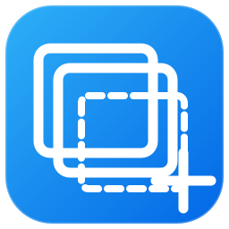

# MultiShot

<p align="center"></p>

<p align="center"><a href="https://github.com/Fuoguz/MultiShot/releases/latest"><strong>下载最新 Windows 版本</strong></a></p>

[English](README.md)

**连续截图，一次粘贴。**

MultiShot 是一个轻量 Windows 截图工具。它不把每一次截图都当成独立任务，而是允许你开启一个临时截图组，连续截多张，最后一次 `Ctrl+V` 把整组图片一起粘贴出去。

## 为什么做 MultiShot

常见截图工具的流程通常是：

`截图 → 复制/保存 → 结束`

MultiShot 的流程是：

`开始 → 截 → 截 → 截 → 完成 → 一次粘贴`

例如你可以连续截网页、报错窗口、控制台和设置页面，然后一次性粘贴到 ChatGPT、飞书、微信、QQ 或 Windows 文件夹。

## 功能

- 连续截图会话。
- **窗口智能吸附**：鼠标移动到窗口上自动高亮，单击直接截取整个窗口。
- **自由框选**：拖动鼠标时自动覆盖窗口吸附。
- 自由框选时显示像素放大镜和坐标。
- 撤销上一张截图。
- 通过 Windows `FileDropList` 把整组 PNG 一次放入剪贴板。
- 同时写入一张纵向拼接 Bitmap，给只支持单图粘贴的软件做 fallback。
- 剪贴板不再引用截图后自动安全清理临时 PNG。
- 托盘常驻、单实例保护。
- **简体中文 / English 双语 UI。**
- **全局快捷键可修改并持久保存。**
- 不依赖 Electron、Node.js、Python、云服务、账号或遥测。

## 默认快捷键

| 操作 | 默认快捷键 |
| --- | --- |
| 截图 | `Ctrl + Shift + X` |
| 撤销上一张 | `Ctrl + Shift + Z` |
| 完成并复制 | `Ctrl + Shift + Enter` |

在主控制条或托盘菜单中打开 **设置**，点击某个快捷键输入框后，直接按新的组合键即可。

保存时会立即重新注册快捷键。如果快捷键已经被其他程序占用，MultiShot 会提示冲突并继续使用原快捷键，不会把程序保存成半失效状态。

配置保存在：

```text
%APPDATA%\MultiShot\settings.ini
```

## 中英文切换

支持：

- 跟随系统
- 简体中文
- English

“跟随系统”会根据 Windows 当前 UI 语言自动选择中文或英文。修改语言后立即生效，不需要重启。

## 运行

1. 克隆或下载仓库。
2. 双击 `run.bat`。
3. 首次运行时，`build.bat` 会调用 Windows .NET Framework 4.x 自带的 C# 编译器，把 `MultiShot.cs` 编译成 `MultiShot.exe`。

正常启用了 .NET Framework 4.x 的 Windows 环境不需要额外安装 Node、Python 等运行时。

> 当前程序未做代码签名。Windows SmartScreen 可能会提示下载或本地编译的 EXE 风险；可以先查看 `MultiShot.cs` 源码再自行构建。

## 构建

```bat
build.bat
```

输出：

```text
MultiShot.exe
```

仓库同时包含 GitHub Actions。push、Pull Request 或手动触发后，会在 Windows Runner 上自动构建并上传 ZIP artifact，方便检查每次提交有没有把构建弄坏。

## 已实测的核心兼容性

目前用户真实 Windows 环境已经验证：

- ChatGPT Web：可一次粘贴多张
- 飞书：可一次粘贴多张
- 微信：可一次粘贴多张
- QQ：可一次粘贴多张
- Windows 文件夹：可一次复制出多张 PNG

不同应用对 Windows 剪贴板格式的解释仍可能不同。

## 产品原则

MultiShot 暂时不追求成为第二个 ShareX。OCR、云同步、完整截图历史、AI 分析、大型标注编辑器等功能，只有在真正增强“连续截图，一次粘贴”这条主流程时才考虑加入。

> **连续截图，一次粘贴。**

## 版本

当前原型：**v0.5.0**

版本记录见 [CHANGELOG.md](CHANGELOG.md)。

## License

目前还没有替项目决定公开许可证。正式作为开源项目发布前建议再选择；如果你的目标是允许他人自由使用和修改，MIT 是常见的宽松选项之一。
